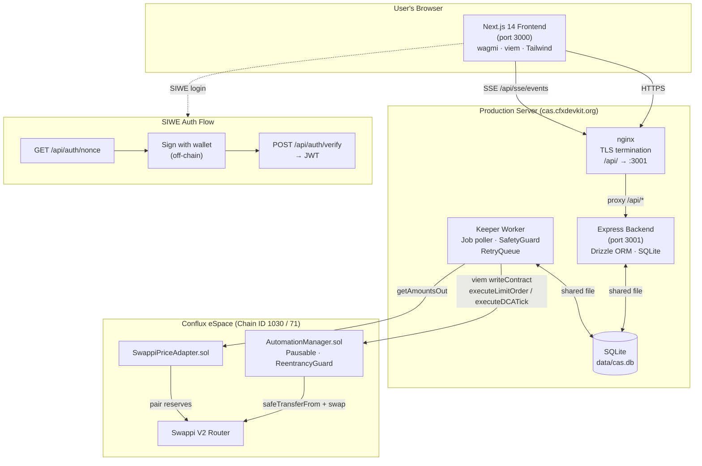

# Conflux Automation Site — Architecture Reference

> **Status:** Live on mainnet + testnet  
> **Bounty:** #08 – Conflux Automation Site ($1,000)  
> Last updated: 2026-02-22

This document is the stable reference for the system as implemented.

---

## System Diagram



---

## Repository Layout

```
conflux-cas/
├── contracts/        # Solidity – Hardhat project (Conflux eSpace)
├── worker/           # Node.js execution keeper service
├── backend/          # Express API (job CRUD, auth, SQLite DB)
├── frontend/         # Next.js 14 App Router
├── shared/           # Shared TypeScript types
├── docs/             # This folder
├── data/             # Runtime SQLite database (gitignored)
├── docker-compose.yml
└── .env.example

**Developer:** start all services concurrently with `pnpm dev` (root `dev` script uses `concurrently` to launch backend, `frontend dev:https`, and worker in parallel). The frontend always runs over **HTTPS** (`--experimental-https`) so that wallets enforcing secure-origin checks (OKX, Bitget, etc.) accept the connection; `pnpm dev:https` can also be run directly inside `frontend/`.
```

---

## Layer 1 — Smart Contracts (`contracts/`)

Solidity on Conflux eSpace (EVM-compatible). Hardhat + OpenZeppelin 5.

### Deployed Contracts (testnet — chain ID 71)

Deployed 2026-02-22. Canonical source: `conflux-contracts/deployments.json`.

| Contract | Address |
|---|---|
| Swappi Router | `0x873789aaF553FD0B4252d0D2b72C6331c47aff2E` |
| Swappi Factory | `0x36B83E0D41D1dd9C73a006F0c1cbC1F096E69E34` |
| SwappiPriceAdapter | `0x88c48e0e8f76493bb926131a2be779cc17ecbedf` |
| AutomationManager | `0x33e5e5b262e5d8ebc443e1c6c9f14215b020554d` |
| PermitHandler | `0x4240882f2d9d70cdb9fbcc859cdd4d3e59f5d137` |

### Deployed Contracts (mainnet — chain ID 1030)

> ⚠️ **These addresses are the authoritative source of truth.** Do not change them without on-chain verification (see *Mainnet Address Verification* below).

| Contract | Address | Verified |
|---|---|---|
| AutomationManager | `0x9D5B131e5bA37A238cd1C485E2D9d7c2A68E1d0F` | ✅ |
| SwappiPriceAdapter | `0xD2Cc2a7Eb4A5792cE6383CcD0f789C1A9c48ECf9` | ✅ |
| PermitHandler | `0x0D566aC9Dd1e20Fc63990bEEf6e8abBA876c896B` | ✅ |
| Swappi V2 Router | `0xE37B52296b0bAA91412cD0Cd97975B0805037B84` | ✅ (only router with deployed bytecode) |
| Swappi V2 Factory | `0xE2a6F7c0ce4d5d300F97aA7E125455f5cd3342F5` | ✅ (via `router.factory()`, fixed 2026-02-21) |

> **wCFX mainnet:** `0x14b2D3bC65e74DAE1030EAFd8ac30c533c976A9b`  
> **USDT mainnet:** `0xfE97E85d13ABd9c1c33384E796F10B73905637cE`

#### Mainnet Address Verification

Before changing any mainnet address, validate on-chain:

```bash
# 1. Confirm a contract has bytecode (returns "0x" if EOA / undeployed)
curl -s -X POST https://evm.confluxrpc.com \
  -H "Content-Type: application/json" \
  -d '{"jsonrpc":"2.0","method":"eth_getCode","params":["<ADDRESS>","latest"],"id":1}'

# 2. Get the real Swappi factory from the router itself
curl -s -X POST https://evm.confluxrpc.com \
  -H "Content-Type: application/json" \
  -d '{"jsonrpc":"2.0","method":"eth_call","params":[{"to":"0xE37B52296b0bAA91412cD0Cd97975B0805037B84","data":"0xc45a0155"},"latest"],"id":1}'
# Returns 0x000...e2a6f7c0ce4d5d300f97aa7e125455f5cd3342f5

# 3. Read the factory currently stored inside the deployed PriceAdapter
curl -s -X POST https://evm.confluxrpc.com \
  -H "Content-Type: application/json" \
  -d '{"jsonrpc":"2.0","method":"eth_getStorageAt","params":["0xD2Cc2a7Eb4A5792cE6383CcD0f789C1A9c48ECf9","0x2","latest"],"id":1}'
```

If the factory stored in the PriceAdapter (`slot 2`) ever diverges from `router.factory()`, run the fix script:

```bash
cd contracts
EXECUTOR_PRIVATE_KEY=0x… pnpm fix-adapter-factory
```

### Key Interfaces

```solidity
// AutomationManager.sol
struct LimitOrderParams {
    address tokenIn;
    address tokenOut;
    uint256 amountIn;
    uint256 minAmountOut;
    uint256 targetPrice;   // 18-decimal fixed-point
    bool    triggerAbove;  // true = execute when price >= target
}

struct DCAParams {
    address tokenIn;
    address tokenOut;
    uint256 amountPerSwap;
    uint256 intervalSeconds;
    uint256 totalSwaps;
    uint256 swapsCompleted;
    uint256 nextExecution;
}

function createLimitOrder(LimitOrderParams calldata p, uint256 slippageBps, uint256 expiresAt) external;
function createDCAJob(DCAParams calldata p, uint256 slippageBps, uint256 expiresAt) external;
function executeLimitOrder(bytes32 jobId, address owner, LimitOrderParams calldata p) external;
function executeDCASwap(bytes32 jobId, address owner, DCAParams calldata p) external;
function cancelJob(bytes32 jobId) external;
function pause() / unpause()  // onlyOwner
```

### Safety Properties
- `Pausable` (OpenZeppelin) — global circuit breaker
- Per-job cancel, owner-only
- Slippage guard: reverts if actual price deviates > `slippageBps`
- No token custody: `safeTransferFrom` is called at execution time; approval is pre-granted by user
- `ReentrancyGuard` on execution functions
- Executor role: only approved keeper address may call execution functions
- Custom errors: `PriceConditionNotMet`, `DCAIntervalNotReached`, `JobNotActive`, `InvalidParams`, etc.

### Test Coverage
12/12 Hardhat tests passing.

---

## Layer 2 — Execution Worker (`worker/`)

Node.js / TypeScript service. Polls DB for active jobs, checks price conditions, submits transactions.

### Source Layout
```
worker/src/
├── main.ts              # Entrypoint; env config + graceful shutdown
├── executor.ts          # Job tick loop; Sell/Buy/DCA dispatch
├── job-poller.ts        # Polls DB + contract events for active jobs
├── price-checker.ts     # Swappi getAmountsOut price source
├── keeper-client.ts     # viem writeContract wrapper (executeLimitOrder / executeDCASwap)
├── safety-guard.ts      # Pre-execution checks (pause flag, slippage, retries, circuit breaker)
├── audit-logger.ts      # Structured pino JSON logs → DB audit_logs table
├── retry-queue.ts       # In-memory retry with exponential backoff
└── db-job-store.ts      # SQLite read/write (shares DB with backend)
```

### Lifecycle
1. Load env (`CONFLUX_RPC_URL`, `EXECUTOR_PRIVATE_KEY`, `DATABASE_URL`, `AUTOMATION_MANAGER_ADDRESS`)
2. `DbJobStore` initialises: `CREATE TABLE IF NOT EXISTS` mirrors backend DDL
3. `JobPoller` starts: polls `data/cas.db` every `POLL_INTERVAL_MS` (default 15 s)
4. For each job: `SafetyGuard.check()` → `PriceChecker.meetsCondition()` → `KeeperClientImpl.execute*()`
5. On success: `markExecuted()` + `AuditLogger.logExecution()`
6. On failure: `incrementRetry()` if < `maxRetries`; `RetryQueue.enqueue()` for backoff; circuit-breaker halts after 5 consecutive errors

### Swap Calldata Notes (keeper)

The keeper builds `swapExactTokensForTokens` calldata in `keeper-client.ts → buildSwapCalldata()`:

- **Deadline:** `now + 1800s` (30 min). Never use less than 10 min — Conflux eSpace block times
  vary and a 5-min deadline reliably expires before the tx is mined under load.
- **Path:** always a direct 2-hop `[tokenIn, tokenOut]`. If the pair has no direct liquidity on
  Swappi the router will revert with `require(success, "Swap failed")`. Multi-hop routing is a
  future improvement.
- **Router:** must match what is passed as `router` in `executeLimitOrder` / `executeDCATick`.
  Both must point to the same deployed Swappi v2 router — **do not mix testnet/mainnet router
  addresses**.


### Safety Controls

> Safety is layered: **off-chain guards in `SafetyGuard`** → **on-chain contract checks** →
> **keeper wallet is unprivileged** — it can only call `executeJob`; it never holds user funds.

| Layer | Control | Detail |
|---|---|---|
| Global pause (off-chain) | `SafetyGuard.check()` reads `settings.paused` each poll tick | Set via `POST /api/admin/pause`; persists across worker restarts |
| Global pause (on-chain) | `preflightCheck()` reads `AutomationManager.paused()` before every tx | Contract-level Pausable from OZ |
| Gas price circuit-breaker | `preflightCheck()` rejects tx when gas price > `MAX_GAS_PRICE_GWEI` (default 1000) | `Promise.race` with `WORKER_RPC_TIMEOUT_MS` timeout |
| RPC timeout / abort | All `readContract`, `simulateContract`, `writeContract` calls wrapped in `withTimeout(AbortController, WORKER_RPC_TIMEOUT_MS)` | Prevents stuck worker on flaky RPC; default 2 min |
| Swap USD cap | `SafetyGuard.check()` rejects swap when `swapUsd > maxSwapUsd` (default $10 000) | Configurable via SDK `SafetyConfig` |
| Slippage guard | On-chain `minAmountOut` check in `AutomationManager`; off-chain `maxSlippageBps` in `SafetyConfig` (default 500 bps = 5 %) | DCA buffer: 15 s before declaring conditionMet |
| Retry cap | `SafetyGuard` blocks execution when `job.retries >= job.maxRetries` (default 5) | Transient errors (`PriceConditionNotMet`, `DCAIntervalNotReached`) do **not** burn retries |
| Transient skip | `PriceConditionNotMet` / `DCAIntervalNotReached` / receipt-not-yet-indexed → return silently | Next poll tick re-evaluates without marking failed |
| On-chain sync | `JobNotActive` → query chain, then `markExecuted()` or `markCancelled()` in DB | Keeps DB in sync with contract state after crash/restart |
| Non-root guard | Worker refuses to start when `process.getuid() === 0` | Prevents running executor with escalated OS privileges |
| Unhandled exception guard | `process.on('unhandledRejection')` + `process.on('uncaughtException')` log + exit | Prevents silent crash loops; ensures crash is visible in logs |
| Non-custodial | Keeper wallet address is an **executor role** only; no `safeTransferFrom` authority outside approved contract calls | Users pre-approve only the `AutomationManager` contract, not the keeper address |
| Private key hygiene | `EXECUTOR_PRIVATE_KEY` redacted from all logs at boot; never logged elsewhere | See `[REDACTED]` in `main.ts` startup log |

---

## Layer 3 — Backend API (`backend/`)

Express v5 + TypeScript. SIWE auth → JWT. Drizzle ORM + SQLite.

### Routes

| Method | Path | Auth | Description |
|---|---|---|---|
| POST | `/api/auth/nonce` | — | Generate SIWE nonce |
| POST | `/api/auth/verify` | — | Verify SIWE signature → JWT |
| GET | `/api/jobs` | JWT | List user's jobs |
| POST | `/api/jobs` | JWT | Create job (DB record + on-chain ID) |
| DELETE | `/api/jobs/:id` | JWT | Cancel job (owner-only) |
| GET | `/api/jobs/:id/executions` | JWT | Execution history for a job |
| GET | `/api/executions` | JWT | All executions for user |
| GET | `/api/pools` | — | Swappi token list (cached 30 min, permanent union map) |
| GET | `/api/pools/refresh` | — | Force cache TTL reset |
| POST | `/api/admin/pause` | JWT+admin | Pause all execution globally |
| POST | `/api/admin/resume` | JWT+admin | Resume execution |
| GET | `/api/system/status` | — | Worker heartbeat + pause state |
| GET | `/api/sse/events` | JWT or `?token=` | Server-Sent Events job state stream |

### DB Schema (SQLite via Drizzle)

```
jobs             (id, owner, type, params_json, status, on_chain_job_id, retries, max_retries, last_error, tx_hash, created_at, updated_at, expires_at)
executions       (id, job_id, tx_hash, timestamp, amount_out)
audit_logs       (id, job_id, action, actor, detail, created_at)
nonces           (address, nonce, expires_at)
worker_heartbeat (id, last_seen, status)
system_state     (key, value)
```

`amount_out` in `executions` is the raw decimal string of the `tokenOut` amount decoded from the last `Transfer(→owner)` log in the execution receipt. `last_error` on `jobs` is cleared on every successful `markExecuted` or `markDCATick` call so stale retry error messages don't persist once the job completes normally.

`CORS_ORIGIN` in `.env` accepts a **comma-separated list** of allowed origins (e.g. `http://localhost:3000,https://localhost:3000`) so both plain and HTTPS local dev work simultaneously.

### SSE: worker-driven DB changes

The backend's SSE broadcaster (`/api/sse/events`) now includes a lightweight DB poller to ensure worker-initiated changes are published to connected clients. Because the execution worker writes directly to the shared SQLite DB (bypassing the REST API), the SSE module periodically (default 15 s) queries `jobs.updated_at > lastPoll - 2s` via `JobService.getJobsUpdatedSince()` and calls the existing `pushJobUpdate()` for each changed job. This guarantees the Dashboard receives updates even when the worker mutates the DB directly. The SSE endpoint still accepts JWTs via the query `?token=` for compatibility with `EventSource`.

### Pool Discovery (`/api/pools`)
- Enumerates all pairs from Swappi factory via `allPairs(i)` → `getAmountsOut` / `symbol` / `name` / `decimals`
- `chunkedSettled(thunks, size=10, delay=150ms)` — processes RPC calls in sequential batches to stay under the 5-request testnet quota
- `_inflight` deduplication: at most one `fetchPools()` chain runs at any time (thundering-herd guard)
- `_permanentTokens` / `_permanentPairs` Maps: accumulate across the process lifetime; route returns permanent set on RPC failure instead of 502
- **Mainnet (GeckoTerminal path):** `TokenInfo` includes `logoURI?: string` sourced from `included[].attributes.image_url` in the GeckoTerminal pools response. No extra API call — logos arrive with the same `?include=base_token,quote_token` request used for metadata. Backfill logic updates `logoURI` for tokens registered without one on an earlier page.
- Tunable via env: `POOLS_CHUNK_SIZE`, `POOLS_CHUNK_DELAY_MS`, `POOLS_BATCH_SIZE`, `POOLS_BATCH_WAIT_MS`, `POOLS_CACHE_TTL_MS`

### Important Implementation Notes
- CFX native is **not** an ERC-20; wCFX (`0x2ED3dddae5B2F321AF0806181FBFA6D049Be47d8` on testnet) is used at the contract level. The backend stores wCFX addresses for both `tokenIn` and `tokenOut` — the frontend `resolveTokenInAddress()` handles the CFX→wCFX substitution before POSTing.

---

## Layer 4 — Frontend (`frontend/`)

Next.js 14 App Router + Tailwind CSS + wagmi v2 + viem.

### Pages

| Route | Component | Description |
|---|---|---|
| `/` | `HomePage` | Home page — opens Strategy Creation modal |
| `/dashboard` | `DashboardPage` | SSE-driven job list with live status |
| `/job/[id]` | `JobDetailPage` | Strategy params, execution history, tx links |
| `/safety` | `SafetyPage` | Global pause/resume + audit log (admin only) |
| `/status` | `StatusPage` | Worker heartbeat / liveness indicator |
| `/create` | `CreatePage` → `StrategyBuilder` | Standalone Limit Order + DCA form (secondary) |

### Key Components
- **`StrategyBuilder`** — Uniswap-style form; tabs for Limit/DCA; inline token selector pills; Market/+1/+5/+10% price presets; expiry quick-picks; per-pair field reset; price-loading shimmer states; **automatic CFX→wCFX wrapping** on submit (see *CFX / wCFX Transparency* below); inline wCFX wrap/unwrap utility panel. Submission opens a **4-step transaction stepper** (wrap → approve → on-chain register → backend save) rendered in a modal that blocks close/Escape/backdrop during execution.
- **`JobCard`** — Status badge, retry counter, max-retries warning banner, Details link
- **`JobTable` / `Dashboard`** — Compact horizontal table view (`JobRow`) replacing the previous tall `JobCard` stack. Each row shows: status badge, type, pair, amount, target / DCA progress + next tick, retries, created time, and actions (Details · Cancel). The component resolves token symbols and decimals from the `cas_pool_meta_v1` localStorage cache (no extra RPC on dashboard render) and subscribes to `/api/sse/events?token=` for live updates. It also implements an SSE `onerror` auto-reconnect (5s) and a 30s fallback poll to re-fetch jobs in case of missed events.
- **`NavBar`** — SIWE sign-in, wallet connect, network badge

### Key Hooks
- **`usePoolTokens(address?)`** — Cache-first (localStorage, TTL 10 min, key `cas_pool_meta_v2`) + stale-while-revalidate; balances fetched in chunks of 5 with 100 ms delay; `knownTokensRef` / `knownPairsRef` never shrink. `TokenWithBalance` carries `logoURI?: string` from GeckoTerminal. `cfxEntryFrom(knownTokens)` builds the synthetic CFX entry by borrowing wCFX's `logoURI` so the native-CFX icon matches WCFX's logo.
- **`useTokenPrice(tokenIn, tokenOut)`** — Fetches `/api/pools` Swappi price + DeFiLlama USD prices; exposes `loading` flag wired into UI shimmer
- **`useJobSSE()`** — Subscribes to `/api/sse/events?token=` for real-time dashboard updates

### CFX / wCFX Transparency
- Token lists show `CFX (native)` using the EIP-7528 sentinel `0xEeee…EEeE`
- `getPairedTokens()` resolves CFX→wCFX for pair lookups, then injects the CFX native entry into results so both sides of a pair always show `CFX` not `wCFX`
- `resolveTokenInAddress()` is applied to **both** `tokenIn` and `tokenOut` before any on-chain call or backend POST
- **Auto-wrap:** when CFX is `tokenIn`, `handleSubmit` checks `WCFX.balanceOf(owner)` before the approval step. If `balance < requiredAmount`, it calls `WCFX.deposit{value: shortfall}()` first. The wallet shows a clear step label: `"Wrapping 0.5 CFX → wCFX…"`. This prevents the `SafeERC20FailedOperation` revert that would otherwise occur at execution time because the user has native CFX but no WCFX ERC-20 balance.
- **Wrap/unwrap panel:** a collapsible info row (`wCFX in wallet: N ▼ manage`) appears below the Sell/Allocate panel whenever CFX is selected. It shows current WCFX balance (green if > 0), an amber auto-wrap preview, and a sub-panel with `CFX → wCFX` / `wCFX → CFX` tabs, amount input, Max button, and confirm button.
- **`WCFX_ABI`** in `frontend/src/lib/contracts.ts` — `deposit()`, `withdraw(wad)`, `balanceOf`, `allowance`, `approve`

### RPC Budget Management (Frontend)
- `batchSize: 5, wait: 16` on all viem HTTP transports (corrected from wrong `size` key — D66)
- `pollingInterval: 30_000` globally; per-call `pollingInterval: 2_000` override for `waitForTransactionReceipt`
- `staleTime: 30_000` + `gcTime: 60_000` on React Query client

---

## Layer 5 — Shared Types (`shared/`)

`@conflux-cas/shared` is a thin wrapper — all core automation types now live in
`@cfxdevkit/sdk/automation` and are re-exported from `shared/src/types/`:

```typescript
// shared/src/types/jobs.ts  (thin re-export)
export type { JobStatus, JobType, BaseJob, LimitOrderJob, DCAJob, Job,
              LimitOrderParams, DCAParams } from '@cfxdevkit/sdk/automation';

// shared/src/types/safety.ts  (thin re-export)
export type { SafetyConfig, SafetyViolation, SafetyCheckResult } from '@cfxdevkit/sdk/automation';
```

The canonical definitions live in `@cfxdevkit/sdk/src/automation/types.ts`:

```typescript
type JobType   = 'limit_order' | 'dca';
type JobStatus = 'pending' | 'active' | 'executed' | 'cancelled' | 'failed' | 'paused';

interface BaseJob {
  id: string;
  owner: string;
  type: JobType;
  status: JobStatus;
  onChainJobId: string | null;   // bytes32 hex from JobCreated event
  retries: number;
  maxRetries: number;
  lastError: string | null;
  createdAt: number;
  expiresAt: number | null;
}
```

The three worker utility classes (`SafetyGuard`, `RetryQueue`, `PriceChecker`) and
`AUTOMATION_MANAGER_ABI` also live in the SDK and are imported by the worker via
thin re-exports in `worker/src/`.

---

## Acceptance Criteria

| Bounty Requirement | Implementation |
|---|---|
| Strategies require explicit approvals; no arbitrary custody | User calls `approve(manager, MAX_UINT256)` once per token; `safeTransferFrom` is called by the contract only at execution time |
| Limit orders execute only when price crosses target ± slippage | `SafetyGuard.check()` off-chain + `PriceConditionNotMet` on-chain revert |
| DCA jobs run on schedule with retry logic | `JobPoller` timer + `RetryQueue` (exponential backoff, cap at `maxRetries`) |
| Global pause + per-job cancel persists across restarts | On-chain `Pausable`; DB `system_state.paused`; worker reads both on startup |
| Dashboard reflects job state + execution history | SSE-driven `JobTable`; `/job/[id]` execution history with ConfluxScan tx links |

---

## Key Technical Decisions

| Decision | Choice | Reason |
|---|---|---|
| Auth | SIWE → JWT | Standard Web3 auth; no password management |
| DB | Drizzle ORM + SQLite (Postgres-upgradable) | Zero-install default; shared file between worker + backend |
| Worker scheduling | `setInterval` + DB polling | No queue infra needed for MVP |
| Frontend auth | JWT in `localStorage` (`cas_jwt`) | Simple; acceptable for testnet bounty scope |
| SSE vs WebSocket | SSE | Simpler, one-directional; sufficient for job state |
| Token batching | Sequential chunks of 5, 100 ms delay | Testnet quota: ≤5 concurrent RPC calls |
| Pool caching | Permanent union maps + 30 min TTL + `_inflight` dedup | Resilient to testnet RPC blips; never shrinks on partial failure |

---

## Dependencies

| Package | Layer | Version |
|---|---|---|
| `hardhat` + `@openzeppelin/contracts` | contracts | 5.x |
| `express` + `drizzle-orm` + `better-sqlite3` | backend | v5 / 0.33 / 11 |
| `siwe` + `jsonwebtoken` + `zod` | backend | latest |
| `pino` + `commander` | worker | v9 / v12 |
| `viem` | worker + frontend | v2.46 |
| `wagmi` | frontend | v2 |
| `next` + `tailwindcss` | frontend | 14 / v3 |

---

## Deployment

### Quick Start

```bash
cp .env.example .env
# fill in DEPLOYER_PRIVATE_KEY, EXECUTOR_PRIVATE_KEY, JWT_SECRET,
# AUTOMATION_MANAGER_ADDRESS, NEXT_PUBLIC_AUTOMATION_MANAGER_ADDRESS

# Option A — local dev
pnpm run dev:backend   # port 3001
pnpm run dev:frontend  # port 3000
pnpm run dev:worker

# Option B — Docker
docker compose up --build
```

### Contract Deployment

```bash
cd contracts

# Testnet
pnpm exec hardhat run scripts/deploy.ts --network espaceTestnet

# Mainnet
DEPLOYER_PRIVATE_KEY=0x… pnpm exec hardhat run scripts/deploy.ts --network espaceMainnet

# copy SwappiPriceAdapter + AutomationManager addresses into .env
```

> **After ANY mainnet deploy:** immediately verify the factory stored inside `SwappiPriceAdapter`
> matches `router.factory()` (see *Mainnet Address Verification* above). If it doesn't, run:
> ```bash
> EXECUTOR_PRIVATE_KEY=0x… pnpm --filter @conflux-cas/contracts fix-adapter-factory
> ```

### Environment Variables (key ones)

```dotenv
DEPLOYER_PRIVATE_KEY=0x…          # with 0x prefix
EXECUTOR_PRIVATE_KEY=0x…          # with 0x prefix
JWT_SECRET=<32 random hex bytes>
AUTOMATION_MANAGER_ADDRESS=0x…
NEXT_PUBLIC_AUTOMATION_MANAGER_ADDRESS=0x…
NEXT_PUBLIC_NETWORK=testnet        # or mainnet
CONFLUX_RPC_URL=https://evmtestnet.confluxrpc.com
# Worker safety / timing
MAX_GAS_PRICE_GWEI=1000          # circuit-breaker: abort tx if gas price exceeds this
WORKER_RPC_TIMEOUT_MS=120000     # abort RPC calls after this many ms (default 2 min)
WORKER_POLL_INTERVAL_MS=15000    # keeper poll interval in ms
DRY_RUN=false                    # set true to evaluate jobs without submitting txs
# RPC tuning (backend pool fetcher)
POOLS_CHUNK_SIZE=10
POOLS_CHUNK_DELAY_MS=150
POOLS_BATCH_SIZE=5
POOLS_BATCH_WAIT_MS=16
POOLS_CACHE_TTL_MS=1800000
```

---

## Future Development

### OCO Orders (One-Cancels-Other)

**Background:** A limit order `≥ target` (take-profit) and a limit order `≤ target` (stop-loss) on the same token pair and same input amount are **mutually exclusive in practice** — only one can execute before the balance is consumed. Today, if a user creates both orders, the second one fires after the first, the `safeTransferFrom` in `AutomationManager` reverts due to insufficient balance, and the job exhausts its retries and enters `failed` state. The second order becomes noisy dead weight rather than being cleanly cancelled.

**Proposed solution — linked OCO pairs:**

1. **Smart contract** — `cancelJob(bytes32 siblingJobId)` is already callable by the executor role; no new contract function is needed.

2. **Shared types** (`shared/src/types/jobs.ts`):
   Add `siblingJobId?: string | null` to `BaseJob` — the DB id of the paired OCO order.

3. **Backend** (`POST /api/jobs`):
   Accept optional `siblingJobId` in the request body. After persisting, verify the sibling belongs to the same owner and update it with a back-reference (bidirectional link).

4. **Worker / executor** (`worker/src/executor.ts`):
   After a successful execution of a job with a non-null `siblingJobId`, call `AutomationManager.cancelJob(sibling.onChainJobId)` on-chain and set `sibling.status = 'cancelled'` in the DB.

5. **Frontend** (`StrategyBuilder`):
   Add an optional "Also set stop-loss" toggle when creating a `≥ target` order. When enabled, show a second target price input. Submit both orders in sequence and link them via `siblingJobId`. The Dashboard table can show a 🔗 indicator on OCO-linked rows.

**Estimated scope:** ~2–3 hours across all layers. No contract redeployment required.
