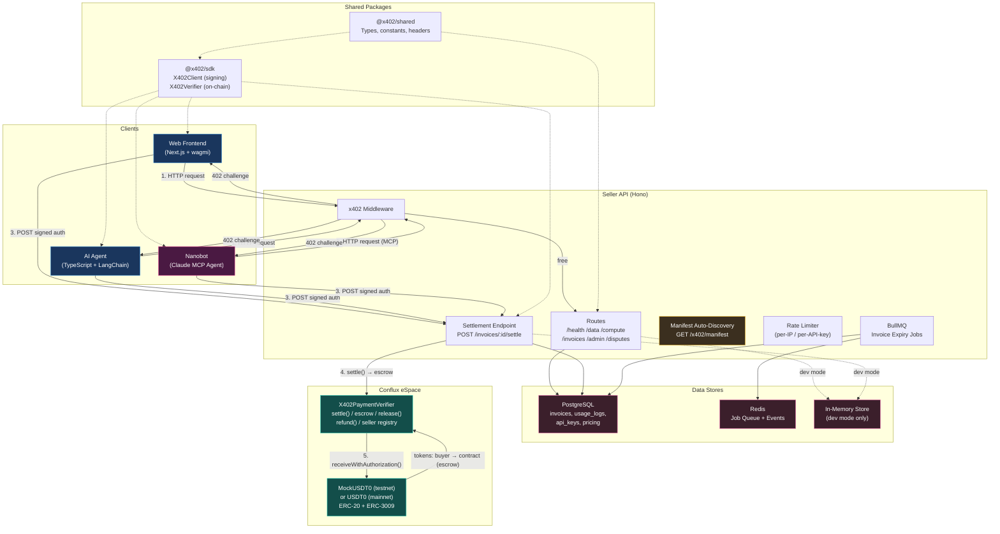

# Architecture

## System Overview

This project is an npm workspaces monorepo with three applications (`apps/`) and three shared packages (`packages/`). It demonstrates **x402 pay-per-request payments** on Conflux eSpace using ERC-3009 `transferWithAuthorization`.

### How it works

1. A **client** (browser or AI agent) hits a premium API endpoint
2. The **Seller API** responds with `402 Payment Required` and payment metadata (amount, token, nonce, expiry)
3. The client **signs an EIP-712 authorization off-chain** (gasless for the buyer)
4. The client submits the signed authorization to the API's `/invoices/:id/settle` endpoint
5. The **facilitator** (seller's service wallet) submits the authorization on-chain via `X402PaymentVerifier.settle()`, paying gas
6. The smart contract executes the token transfer (buyer → contract escrow) and records the payment
7. The API verifies the on-chain settlement and returns the premium data
8. After the escrow grace period (default 24h, configurable per seller), funds can be released to the seller via `release()`

> Key insight: **buyers never pay gas**. The seller's facilitator wallet pays for on-chain settlement. Buyers only sign an off-chain EIP-712 message.

---

## System Diagram



---

## Component Overview

| Component | Tech | Purpose | Key files |
|-----------|------|---------|-----------|
| **Web Frontend** | Next.js 14, React 18, Tailwind, wagmi, ConnectKit | Wallet connect, endpoint catalog, paywall UI, seller directory, agent chat, admin dashboard, seller registration, token minting, network switching | `apps/web/src/` |
| **AI Agent** | TypeScript, LangChain, better-sqlite3, viem | Autonomous 402 detection, ERC-3009 signing, spend tracking | `apps/agent/src/` |
| **Nanobot** | Claude MCP Agent | x402 Payment Concierge — LLM-powered assistant with MCP tools for autonomous 402 paywall handling | `apps/nanobot/` |
| **Seller API** | Hono, pino, BullMQ | x402 middleware, settlement with escrow, rate limiting, admin CRUD, disputes, manifest auto-discovery | `apps/seller-api/src/` |
| **PostgreSQL** | postgres:16 | Invoices, usage logs, API keys, endpoint pricing (production mode) | `apps/seller-api/src/db/` |
| **Redis** | redis:7 | BullMQ job queue for invoice expiration (production mode) | `apps/seller-api/src/jobs/` |
| **In-Memory Store** | TypeScript Map/Array | Dev-mode replacement for Postgres — no setup required | `apps/seller-api/src/db/memory.ts` |
| **X402PaymentVerifier** | Solidity ^0.8.24, OpenZeppelin | On-chain settlement with escrow, replay protection, refunds, release, seller registry, token timelock | `packages/contracts/contracts/` |
| **MockUSDT0** | Solidity ^0.8.24 | ERC-20 + ERC-3009 test token (anyone can mint on testnet) | `packages/contracts/contracts/` |
| **@x402/sdk** | TypeScript, viem | EIP-712 signing client + on-chain settlement verifier | `packages/x402-sdk/src/` |
| **@x402/shared** | TypeScript | Shared types, constants, x402 header builders | `packages/shared/src/` |

---

## Dev Mode vs Production Mode

| Aspect | Dev Mode (`npm run dev:api:local`) | Production Mode (`npm run dev:api` or Docker) |
|--------|-----------------------------------|-----------------------------------------------|
| **Data storage** | In-memory (resets on restart) | PostgreSQL (persistent) |
| **Job queue** | Disabled | BullMQ + Redis |
| **Invoice expiry** | Manual/none | Automatic via background job |
| **External deps** | None — just Node.js | Postgres + Redis (or Docker Compose) |
| **Best for** | Local development, demos, bounty review | Production, multi-session testing |

---

## Monorepo Layout

```
11-espace-x402-boilerplate/
├── apps/
│   ├── seller-api/          # REST API server
│   │   ├── src/
│   │   │   ├── index.ts         # Production entry (Postgres + Redis)
│   │   │   ├── dev.ts           # Dev entry (in-memory store)
│   │   │   ├── app.ts           # Hono app + route registration
│   │   │   ├── middleware/      # x402, rate limiter, logging, admin auth
│   │   │   ├── routes/          # health, data, compute, invoices, admin, disputes, manifest
│   │   │   ├── db/              # Postgres client, in-memory store, migrations
│   │   │   ├── lib/             # Config, logger, verifier, metrics, alerts
│   │   │   └── jobs/            # BullMQ workers (invoice expiry, event logger)
│   │   └── Dockerfile
│   │
│   ├── web/                 # Next.js frontend
│   │   ├── src/
│   │   │   ├── app/             # Next.js pages (home, admin, architecture, register)
│   │   │   ├── components/      # EndpointCatalog, PaywallModal, SellerDirectory, AgentChat, etc.
│   │   │   └── lib/             # API client, wagmi config
│   │   └── Dockerfile
│   │
│   ├── nanobot/             # Claude MCP agent (x402 Payment Concierge)
│   │   ├── config.json          # MCP server + provider config
│   │   └── workspace/
│   │       └── SOUL.md          # Agent personality + capabilities
│   │
│   └── agent/               # AI agent
│       ├── src/
│       │   ├── index.ts         # CLI entry (demo, langchain, direct modes)
│       │   ├── agent.ts         # Core agent logic (402 detection + payment)
│       │   ├── langchain-agent.ts  # LangChain-specific agent
│       │   ├── tools.ts         # 7 LangChain tools
│       │   ├── spend.ts         # SpendTracker (cap + daily budget)
│       │   ├── store.ts         # SQLite persistence
│       │   ├── mcp-server.ts    # MCP server for Claude integration
│       │   └── config.ts        # LLM + env config
│       └── Dockerfile
│
├── packages/
│   ├── shared/              # @x402/shared
│   │   └── src/
│   │       ├── types.ts         # X402PaymentChallenge, ERC3009Authorization, Invoice, etc.
│   │       ├── constants.ts     # Chain IDs, token addresses, network configs
│   │       └── headers.ts       # x402 HTTP header builders/parsers
│   │
│   ├── x402-sdk/            # @x402/sdk
│   │   └── src/
│   │       ├── client.ts        # X402Client — EIP-712 signing for transferWithAuthorization
│   │       ├── verifier.ts      # X402Verifier — on-chain settlement verification
│   │       ├── abi.ts           # Contract ABI definitions
│   │       └── chain.ts         # Chain configs (testnet, mainnet)
│   │
│   └── contracts/           # Solidity smart contracts
│       ├── contracts/
│       │   ├── MockUSDT0.sol              # ERC-20 + ERC-3009 test token
│       │   └── X402PaymentVerifier.sol    # Settlement facilitator contract
│       ├── scripts/deploy.ts              # Hardhat deployment script
│       ├── test/                          # Hardhat tests
│       └── hardhat.config.ts
│
├── docs/                    # Documentation
│   ├── architecture.md      # This file
│   ├── sequence.md          # Payment flow sequence diagrams
│   ├── runbooks.md          # Operational guides
│   └── SECURITY.md          # Threat model & hardening
│
├── monitoring/              # Observability
│   ├── prometheus.yml       # Scrape config
│   └── grafana/             # Dashboards + provisioning
│
├── postman/                 # API testing
│   └── x402-collection.json
│
├── scripts/
│   └── preflight.sh         # Pre-deployment config verification
│
├── docker-compose.yml       # Postgres, Redis, API, Web, Agent, Prometheus, Grafana
├── package.json             # Root workspace config
└── tsconfig.base.json       # Shared TypeScript config
```

---

## Related Docs

- [**Sequence Diagrams**](sequence.md) — Payment flow (happy path, agent, refund, invoice expiry)
- [**Runbooks**](runbooks.md) — Operational guides (rotate keys, adjust pricing, disputes)
- [**Security**](SECURITY.md) — Threat model and hardening recommendations
