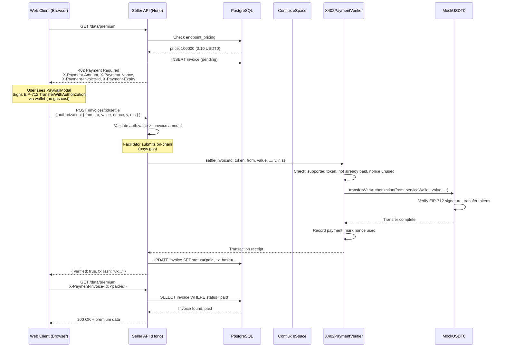
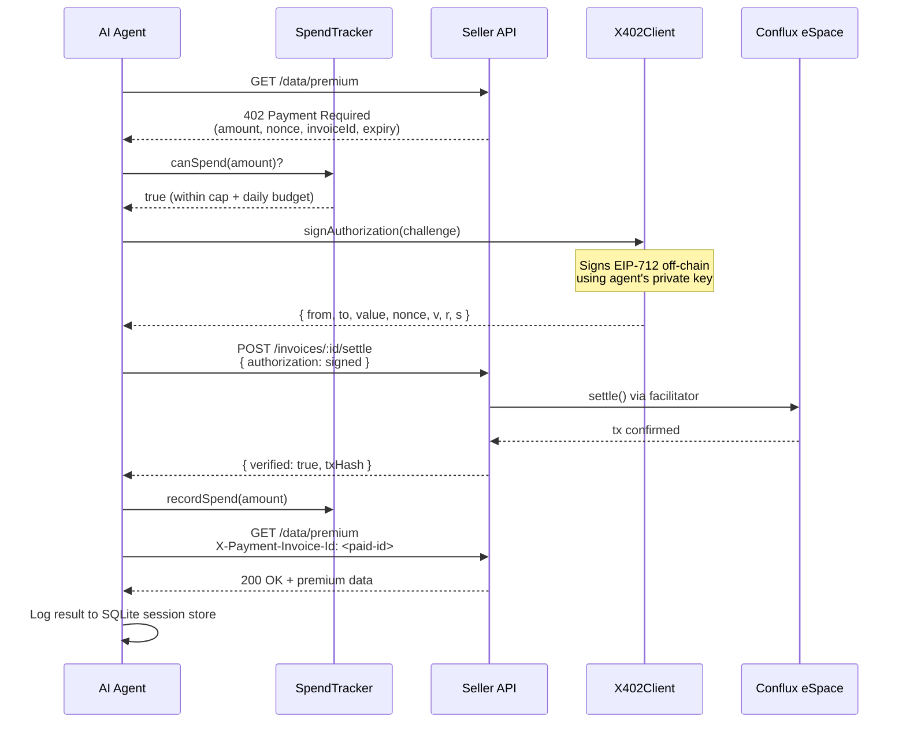
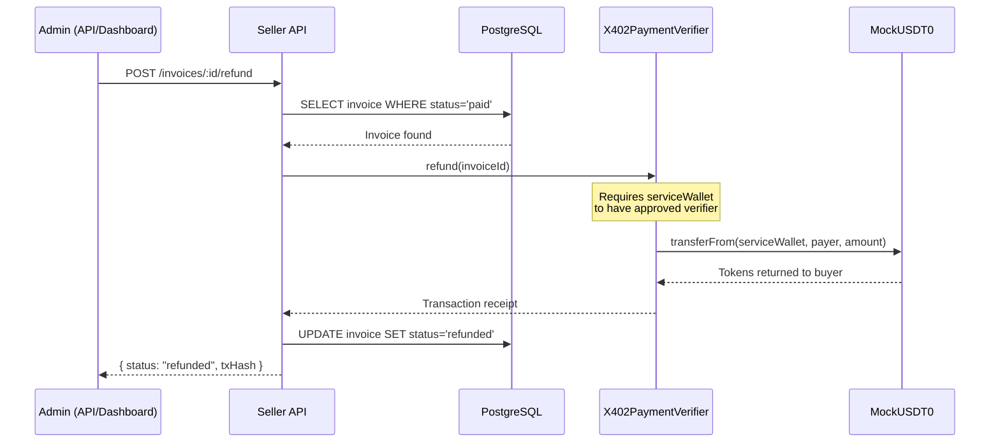
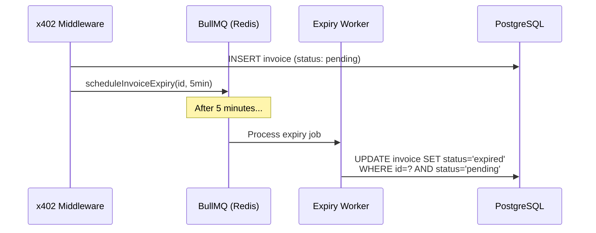

# Payment Sequence Diagrams

## Happy Path: Web Client Premium Endpoint

```mermaid
sequenceDiagram
    participant User as Web Client (Browser)
    participant API as Seller API (Hono)
    participant DB as PostgreSQL
    participant Chain as Conflux eSpace
    participant Verifier as X402PaymentVerifier
    participant Token as MockUSDT0

    User->>API: GET /data/premium
    API->>DB: Check endpoint_pricing
    DB-->>API: price: 100000 (0.10 USDT0)
    API->>DB: INSERT invoice (pending)
    API-->>User: 402 Payment Required<br/>X-Payment-Amount, X-Payment-Nonce,<br/>X-Payment-Invoice-Id, X-Payment-Expiry

    Note over User: User sees PaywallModal<br/>Signs EIP-712 TransferWithAuthorization<br/>via wallet (no gas cost)

    User->>API: POST /invoices/:id/settle<br/>{ authorization: { from, to, value, nonce, v, r, s } }
    API->>API: Validate auth.value >= invoice.amount

    Note over API: Facilitator submits on-chain<br/>(pays gas)

    API->>Verifier: settle(invoiceId, token, from, value, ..., v, r, s)
    Verifier->>Verifier: Check: supported token, not already paid, nonce unused
    Verifier->>Token: transferWithAuthorization(from, serviceWallet, value, ...)
    Token->>Token: Verify EIP-712 signature, transfer tokens
    Token-->>Verifier: Transfer complete
    Verifier->>Verifier: Record payment, mark nonce used
    Verifier-->>API: Transaction receipt

    API->>DB: UPDATE invoice SET status='paid', tx_hash=...
    API-->>User: { verified: true, txHash: "0x..." }

    User->>API: GET /data/premium<br/>X-Payment-Invoice-Id: <paid-id>
    API->>DB: SELECT invoice WHERE status='paid'
    DB-->>API: Invoice found, paid
    API-->>User: 200 OK + premium data
```

## AI Agent Autonomous Flow

```mermaid
sequenceDiagram
    participant Agent as AI Agent
    participant Spend as SpendTracker
    participant API as Seller API
    participant SDK as X402Client
    participant Chain as Conflux eSpace

    Agent->>API: GET /data/premium
    API-->>Agent: 402 Payment Required<br/>(amount, nonce, invoiceId, expiry)

    Agent->>Spend: canSpend(amount)?
    Spend-->>Agent: true (within cap + daily budget)

    Agent->>SDK: signAuthorization(challenge)
    Note over SDK: Signs EIP-712 off-chain<br/>using agent's private key
    SDK-->>Agent: { from, to, value, nonce, v, r, s }

    Agent->>API: POST /invoices/:id/settle<br/>{ authorization: signed }
    API->>Chain: settle() via facilitator
    Chain-->>API: tx confirmed
    API-->>Agent: { verified: true, txHash }

    Agent->>Spend: recordSpend(amount)

    Agent->>API: GET /data/premium<br/>X-Payment-Invoice-Id: <paid-id>
    API-->>Agent: 200 OK + premium data

    Agent->>Agent: Log result to SQLite session store
```

## Refund Flow (Admin-Initiated)

```mermaid
sequenceDiagram
    participant Admin as Admin (API/Dashboard)
    participant API as Seller API
    participant DB as PostgreSQL
    participant Verifier as X402PaymentVerifier
    participant Token as MockUSDT0

    Admin->>API: POST /invoices/:id/refund
    API->>DB: SELECT invoice WHERE status='paid'
    DB-->>API: Invoice found

    API->>Verifier: refund(invoiceId)
    Note over Verifier: Requires serviceWallet<br/>to have approved verifier
    Verifier->>Token: transferFrom(serviceWallet, payer, amount)
    Token-->>Verifier: Tokens returned to buyer
    Verifier-->>API: Transaction receipt

    API->>DB: UPDATE invoice SET status='refunded'
    API-->>Admin: { status: "refunded", txHash }
```

## Invoice Expiry (Background Job)

```mermaid
sequenceDiagram
    participant MW as x402 Middleware
    participant Queue as BullMQ (Redis)
    participant Worker as Expiry Worker
    participant DB as PostgreSQL

    MW->>DB: INSERT invoice (status: pending)
    MW->>Queue: scheduleInvoiceExpiry(id, 5min)

    Note over Queue: After 5 minutes...

    Queue->>Worker: Process expiry job
    Worker->>DB: UPDATE invoice SET status='expired'<br/>WHERE id=? AND status='pending'
```
